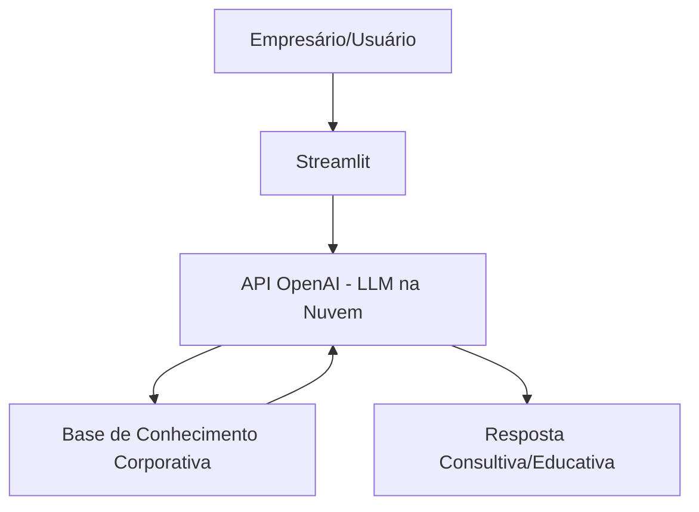

# 🏭 Otto - Otimizador de Crédito Corporativo

> Agente de IA Generativa que ensina conceitos de estruturação de crédito e finanças empresariais de forma simples, focando em PMEs e usando o fluxo de caixa real da empresa como base para exemplos práticos.

## 💡 O Que é o Otto?

O Otto atua como um educador financeiro corporativo especializado em **crédito PJ**. Ele **ensina**, não vende e nem aprova crédito. Seu objetivo é explicar conceitos complexos do mercado bancário (como Capital de Giro, Antecipação de Recebíveis, FINAME e CDC) usando uma abordagem didática, voltada para gestores e empresários que precisam equilibrar o fluxo de caixa ou financiar bens operacionais.

**O que o Otto faz:**
- ✅ Explica modalidades de crédito bancário de forma acessível.
- ✅ Usa o fluxo de caixa da empresa (Planejado vs. Realizado) para diagnósticos educativos.
- ✅ Ajuda a identificar a lógica de financiamento para bens móveis (maquinário/veículos) e imóveis (galpões).
- ✅ Ensina estratégias para cobrir descasamentos entre prazos de fornecedores e recebimentos.

**O que o Otto NÃO faz:**
- ❌ Não faz recomendação de investimentos (foco é crédito e caixa).
- ❌ Não acessa dados bancários sensíveis (como senhas ou tokens).
- ❌ Não garante nem realiza a aprovação de linhas de crédito perante os bancos.
- ❌ Não substitui o gerente de relacionamento ou um consultor financeiro certificado.

## 🏗️ Arquitetura



**Stack:**
- Interface: Streamlit
- LLM: OpenaAi
- Dados: JSON/CSV mockados

## 📁 Estrutura do Projeto

```
├── data/                          # Base de conhecimento corporativa
│   ├── perfil_cliente_pj.json     # Perfil da empresa (CNAE) e metas
│   ├── fluxo_caixa_realizado.csv  # Histórico financeiro (Planejado vs Realizado)
│   ├── historico_atendimento.csv  # Interações anteriores de crédito
│   └── linhas_credito_pj.json     # Modalidades (Giro, CDC, FINAME, etc)
│
├── docs/                          # Documentação completa
│   ├── 01-documentacao-agente.md  # Caso de uso e persona
│   ├── 02-base-conhecimento.md    # Estratégia de dados e fluxos
│   ├── 03-prompts.md              # System prompt e Few-Shot exemplos
│   ├── 04-metricas.md             # Avaliação de qualidade
│   └── 05-pitch.md                # Apresentação do projeto
│
└── src/
    └── app.py                     # Aplicação Streamlit
```

## 🚀 Como Executar

### 1. Configurar API da OpenAI

```bash
export OPENAI_API_KEY="sua-chave-aqui"
```

### 2. Instalar Dependências

```bash
pip install streamlit pandas openai
```

### 3. Rodar o otto

```bash
streamlit run src/app.py
```

## 🎯 Exemplo de Uso

**Pergunta:** "Otto, qual a diferença entre usar a Conta Garantida ou o limite do Empresarial Flex?"  
"**Otto**: "O Empresarial Flex é um limite automático na conta para emergências de curtíssimo prazo, mas com juros altos. Já a Conta Garantida funciona como um empréstimo separado com garantias (como recebíveis), o que reduz a taxa de juros. Quer entender qual faz mais sentido para o seu momento?"


## 📊 Métricas de Avaliação

| Métrica | Objetivo |
|---------|----------|
| **Assertividade** | O agente responde à dor financeira (caixa/aquisição) de forma precisa? |
| **Segurança** | Evita inventar regras de crédito e taxas irreais (anti-alucinação)? |
| **Coerência** |A resposta é adequada para uma PME conforme seu setor (CNAE)? |

## 🎬 Diferenciais

- **Personalização:** Usa os dados do próprio cliente nos exemplos
- **Consultivo e Didático:** Ensina o empresário a escolher a linha de crédito correta por finalidade (Giro vs. Bens)
- **Especialista:**: Foco em fluxo de caixa corporativo e ciclos de produção industriais.


## 📝 Documentação Completa

Toda a documentação técnica, estratégias de prompt e casos de teste estão disponíveis na pasta [`docs/`](./docs/).
